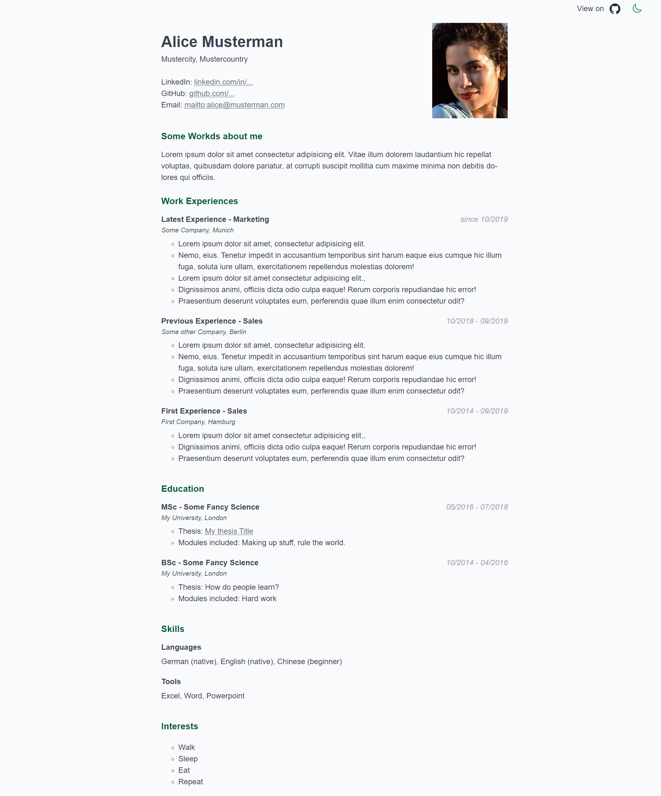

# React-CV

Build your own CV website in a few minutes.

# Example

<div style="text-align:center">
  
</div>

# Tech Stack

This application is build with no backend.
Essentially, it is a simple react application create with Vite.
Styled-Components is used for styling.

# How to Use

1. Clone repository.
2. Run `npm install` to install dependencies.
3. Rename `public/cv_data_example` to `public/cv_data`.
4. Run `npm run dev`.
5. Modify the data in `public/cv_data`.
6. Run `npm run build` to build your CV. It will be available in folder `dist`.

# Modification Details

All data is stored in `data.jsx`.
The basic syntax of the file is defined like this:

```js
{
  name: "Alice Musterman",
  picture: "/cv_data/profile.jpg",
  address: "Mustercity, Mustercountry",
  socials: [
    { name: "LinkedIn", url: "https://linkedin.com/in/..." },
  ],
  aboutMe: {
    title: "Some Workds about me",
    text: "Some personal profile note",
  },
  sections: [
    {
      name: "Work Experiences",
      content: [...],
    },
    {
      name: "Education",
      content: [...]
    },
  ],
};
```

While `name`, `picture`, `address`, `socials`, and `aboutMe` should be self-explaining, `sections`' contents follow the following format:

```js
{
    title: "Headline",
    subTitle: "Second part of headline",
    when: "Some date range, can be used for links as well",
    where: "Location",
    info: [
        "Information array",
        "Each element is a bullet"
    ],
},
```

The example in `public/cv_data_example/data.jsx` helps understanding how it works and why it is a JSX file.
The latter allows to easily add react components wherever needed, if needed.
